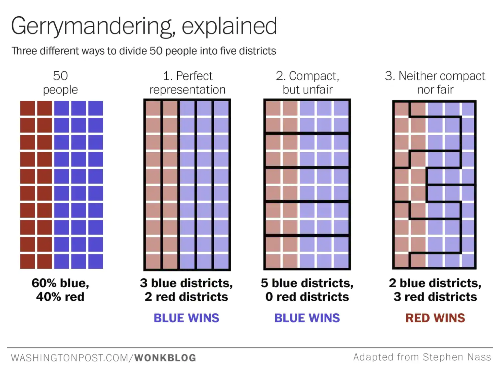
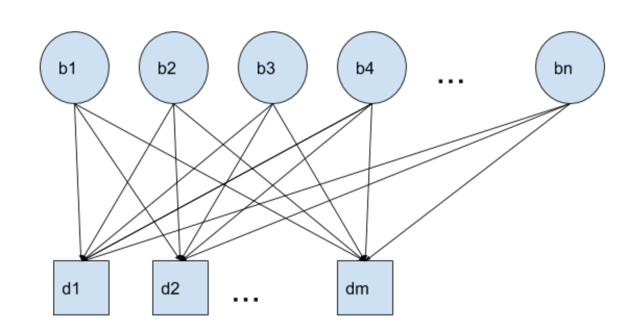
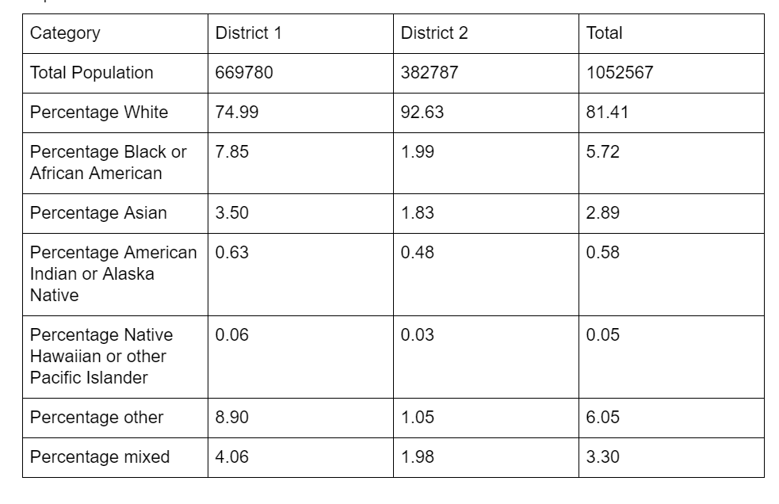
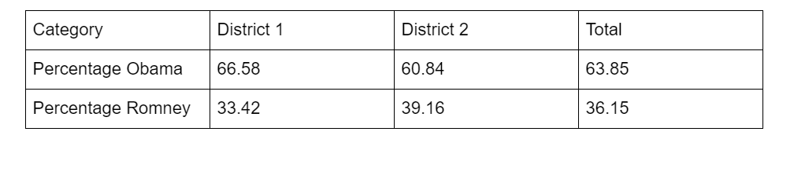
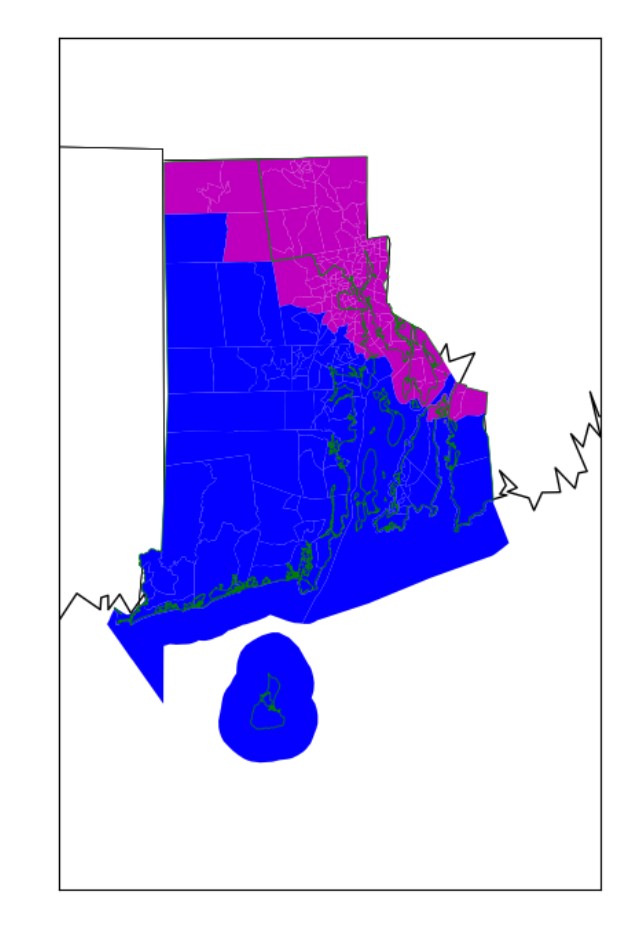
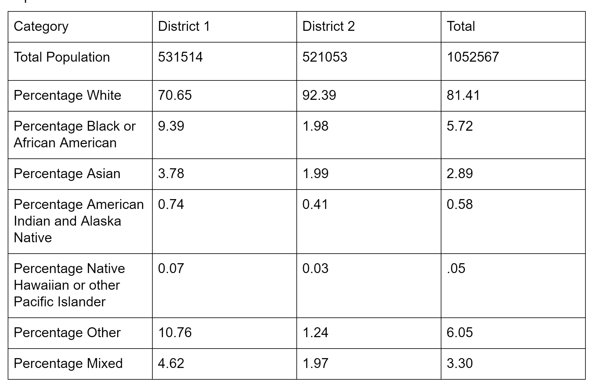
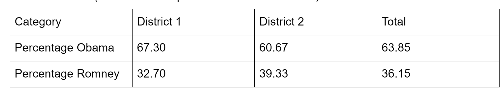
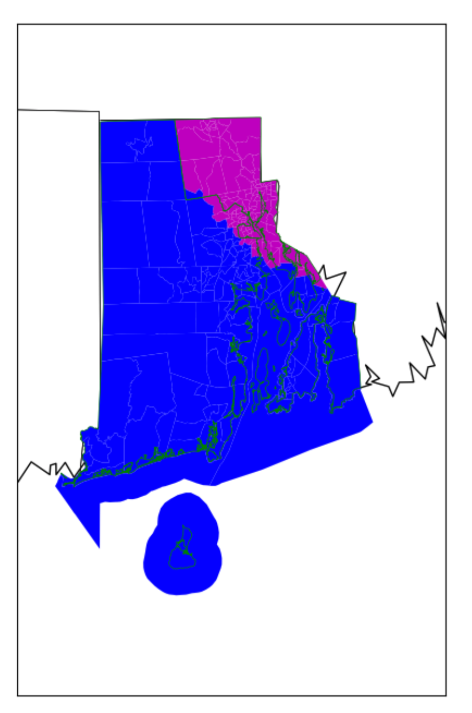
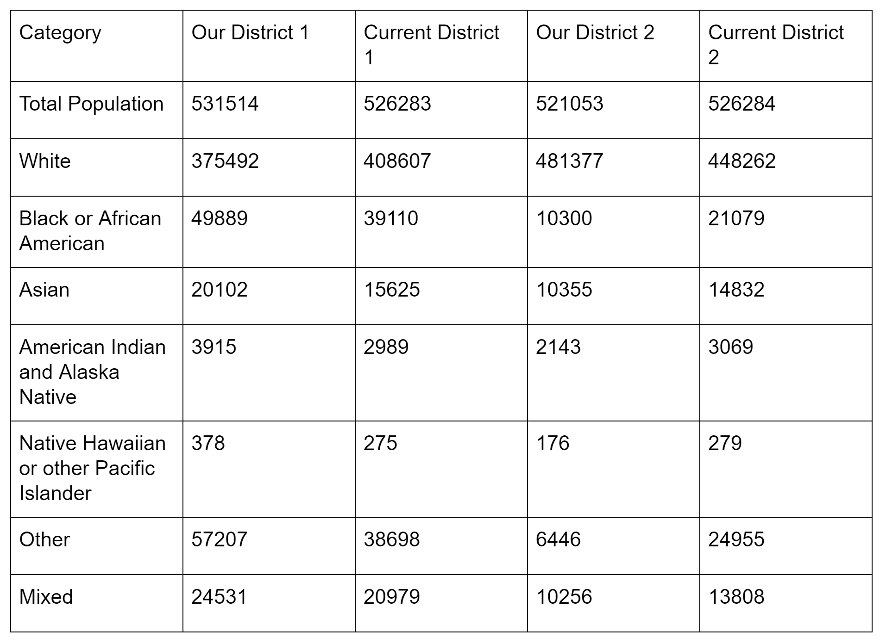

# Utilizing Linear Programming to Eliminate Gerrymandering

## Background

Gerrymandering is the process of manipulating the boundaries of political districts to favor a particular party. When this occurs, there are cases where the majority of the population may vote with one party but the majority of the seats are with the other party. This should not occur.

 This project was a proof of concept using the state of Rhode Island to see whether linear programming could be used to draw legal, fair political districts without human influence to avoid the occurrence of the above mentioned scenario
 
## Criteria

There are certain criteria to identify whether or not the political districting was done well. Some of those criteria are:
1. Integrity: Each territory must belong to exactly one district
2. Contiguity: All areas covered by a single district must be connected somehow
3. No enclaves: A single district should not surround another district.
4. Compactness: A district should not be unnecessarily spread out or odd shaped
5. Population equality: districts should contain a similar number of constituents

From these criteria, we can see that this is really an optimization problem. We want to form some assignment of census blocks to districts that satisfies the first three requirements and finds a good balance between compactness and population equality. We could also factor in whether the districts have balanced proportions of different ethnic groups and political preferences. Since this does boil down to an optimization problem, linear programming is the perfect tool to tackle this.

## First Attempt
In order to accomplish this, we first wrote constraints to cover integrity and wrote an objective function which covered compactness and population equality. At this stage, we did not explicitly cover enclaves or contiguity, hoping that compactness would indirectly satisfy these criteria. We used a network flow formulation to accomplish this where each “block” has an arc to each district center.

### Variables:
1. F  : where Fij is the number of people from block i assigned to district j
2. X: a binary variable where Xij  is 1 if block i is assigned to district j and 0 otherwise
3. s: the population of the smallest district
4. l: the population of the largest district
5. g: the gap in size between the largest and smallest districts

### Parameters
1. dij  is the distance from block i to the center of district j. The district centers were calculated by solving another optimization problem to minimize the population weighted squared distances between electoral districts and meshblocks based on the current district assignments.
2. pi  is the population of block i
3. cd  is the component of the cost vector associated with compactness
4. cp  is the component of the cost vector associated with population equality

### Objective Function

minimize: cd∑ij (dij pi) + cpg

### Constraints
1. All people in the district must be assigned to a district  
∑j Fij = pi 		for all i
2. X must be 1 if the population flow is > 0. X is 0 otherwise  
Fij <= M * Xij		for all i,j and some large M

3. Find the smallest district population  
s <= ∑i Fij 		for all j
4. Find the largest district population  
l >= ∑i Fij 		for all j
5. g = l - s

### Population Results

### Political Results 
Based on 2012 presidential election results

### Resulting Map

We can see that there is some mixing of the blue and magenta which violates the contiguity requirement. We can also see that the population results are not quite balanced. Let’s revise our formulation to include constraints that resolve this and also achieve better population equity.

## Second Attempt

### Additional Variables
We will first introduce some additional variables:
1. y: where yijk indicates the amount of flow from block i to block j for district k
2. w: where wik  is 1 if block i is the hub for district k and 0 otherwise
Note: a block i can be considered a hub of district j if block i can be reached by all other blocks in district j

### Additional parameters
And some additional parameters:

1. p: the target population of each district which in this case is simply the total population divided by the number of districts
2. n: the total number of blocks
3. 𝛼: tolerance on each district's population deviation from p

### Additional Constraints 
Now we can add our contiguity constraints and population constraints

1. Each district must have exactly one hub  
∑i wik = 1					for all k
2. Flow constraint: flow into block i cannot be greater than the total number of blocks  
∑j yjik <= (n - 1) Xik				for all k,i and for all j in neighbors[i]
3. Lower bound on district population  
∑i pi * Xik >= (1 - 𝛼) p				for all k
4. Upper bound on district population  
∑i (pi * Xik <= (1 + 𝛼) p				for all k

### Population Results

### Political Results 
Based on 2012 presidential election results

### Resulting Map

We can see that there is no longer any mixing of the blue and the magenta. In addition, we have overlaid the lines of the current district boundaries (green). We can see that the current version has some oddly drawn lines which are an indication of gerrymandering. This is eliminated in our updated version.

### Comparison to Current Districting

Our districts are not as population balanced or racially balanced as the original ones, but as seen above, they are more compact. We could improve our formulations by reducing the value of alpha, by using census blocks instead of census tracts for more flexibility and by incorporating race balancing into the formulation

## Conclusions
Linear Programming is a promising way to generate political districts without human intervention. We were able to successfully generate population balanced, contiguous, compact districts. These districts are also fairly balanced politically. However, we could spend some time characterizing the cost function to potentially get even better results. In addition, our model does not incorporate race or political balancing at all. 

One challenge with this approach is that it is very computation heavy. It is preferable to use smaller chunks when assigning districting to get more flexibility and make it easier to balance the population, but even the small state of Rhode Island has a very large number of census blocks (~25000). The initial formulation did not have as many constraints or variables, so the problem size was still manageable. However, the second formulation caused the size to increase to the point that we were unable to solve it on our laptops, so we had to allocate census tracts instead of census blocks. The results of the first formulation which are reported here were calculated using census tracts so that we could do an apples to apples comparison of both versions.

## References

* Institute for Geoinformation and Cartography, Vienna University of Technology, GuÞhausstrasse 27 ^ 29, Vienna 1040, Austria; e-mail: shirabe@geoinfo.tuwien.ac.at Received 28 September 2007; in revised form 6 August 2008; published online 2 October 2009

* Scozzari, Andrea. “Districting and Gerrymandering.” 8-12 July 2014. University Niccol`o Cusano. http://research.illc.uva.nl/COST-IC1205/documents/Caen-2014-Slides/Scozarri.pdf

* George, John A and Bruce W Lamar and Chris A Wallace. “Political district determination using large-scale network optimization.” Socio-Economic Planning Sciences. March 1997. https://www.sciencedirect.com/science/article/pii/S003801219600016X
